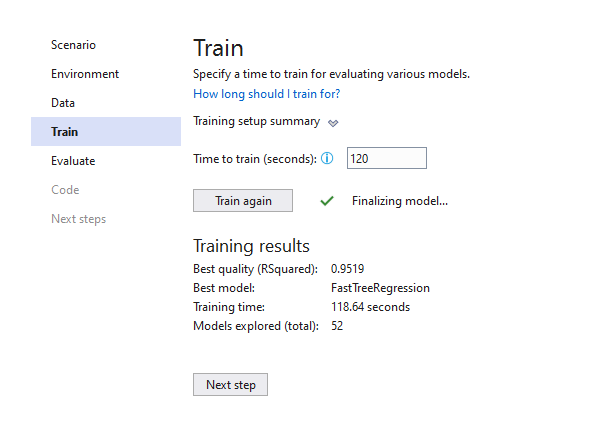

# TaxiFareWithML
Predict Taxi fare using Machine Learning Model Builder in Visual Studio

## Result

| # | Trainer | RSquared | Absolute-loss | Squared-loss | RMS-loss | Duration | #Iteration |
| --- | --- | --- | --- | --- | --- | --- | --- |
|1 | SdcaRegression | 0.8986 | 0.80 | 9.63 | 3.10 | 2.3 | 1 |
|2 | LightGbmRegression | 0.9459 | 0.40 | 5.14 | 2.27 | 1.4 | 2 |
|3 | FastTreeRegression | 0.9440 | 0.42 | 5.32 | 2.31 | 1.6 | 3 |
|4 | FastTreeTweedieRegression | 0.9370 | 0.42 | 5.98 | 2.44 | 1.8 | 4 |
|5 | FastForestRegression | 0.8949 | 1.08 | 9.98 | 3.16 | 1.8 | 5 |
|6 | LbfgsPoissonRegression | 0.6748 | 2.88 | 30.88 | 5.56 | 1.1 | 6 |
|7 | OnlineGradientDescentRegression | 0.4042 | 4.50 | 56.57 | 7.52 | 0.7 | 7 |
|8 | OlsRegression | 0.9016 | 0.74 | 9.34 | 3.06 | 0.7 | 8 |
|9 | LightGbmRegression | 0.9432 | 0.44 | 5.39 | 2.32 | 1.2 | 9 |
|10 | FastTreeRegression | 0.8586 | 2.02 | 13.42 | 3.66 | 1.6 | 10 |
|11 | FastTreeTweedieRegression | 0.5432 | 4.00 | 43.37 | 6.59 | 2.2 | 11 |
|12 | LightGbmRegression | 0.8762 | 1.55 | 11.76 | 3.43 | 1.3 | 12 |
|13 | FastTreeRegression | 0.3065 | 5.82 | 65.85 | 8.11 | 1.2 | 13 |
|14 | FastTreeTweedieRegression | 0.9226 | 0.67 | 7.35 | 2.71 | 0.8 | 14 |
|15 | LightGbmRegression | 0.9391 | 0.41 | 5.78 | 2.40 | 1.6 | 15 |
|16 | FastTreeRegression | 0.9519 | 0.40 | 4.56 | 2.14 | 5.4 | 16 |
|17 | FastTreeTweedieRegression | 0.6126 | 3.60 | 36.79 | 6.07 | 2.7 | 17 |
|18 | LightGbmRegression | 0.7447 | 2.52 | 24.25 | 4.92 | 1.2 | 18 |
|19 | FastTreeRegression | 0.9031 | 1.44 | 9.20 | 3.03 | 1.9 | 19 |
|20 | FastTreeTweedieRegression | 0.9261 | 0.43 | 7.02 | 2.65 | 6.9 | 20 |
|21 | LightGbmRegression | 0.9041 | 0.83 | 9.11 | 3.02 | 1.5 | 21 |
|22 | FastTreeRegression | -0.2964 | 8.28 | 123.10 | 11.10 | 0.7 | 22 |
|23 | FastTreeTweedieRegression | 0.9251 | 0.42 | 7.11 | 2.67 | 7.0 | 23 |
|24 | LightGbmRegression | 0.9472 | 0.39 | 5.01 | 2.24 | 2.4 | 24 |
|25 | FastTreeRegression | 0.9454 | 0.43 | 5.18 | 2.28 | 1.3 | 25 |
|26 | FastTreeTweedieRegression | 0.3356 | 5.05 | 63.09 | 7.94 | 1.0 | 26 |
|27 | LightGbmRegression | 0.8956 | 0.72 | 9.91 | 3.15 | 1.2 | 27 |
|28 | FastTreeRegression | -1.0210 | 10.64 | 191.90 | 13.85 | 1.0 | 28 |
|29 | FastTreeTweedieRegression | 0.9366 | 0.45 | 6.02 | 2.45 | 0.9 | 29 |
|30 | LightGbmRegression | 0.9461 | 0.39 | 5.12 | 2.26 | 1.7 | 30 |
|31 | FastTreeRegression | -0.5218 | 8.64 | 144.50 | 12.02 | 0.6 | 31 |
|32 | FastTreeTweedieRegression | -0.6724 | 8.88 | 158.81 | 12.60 | 14.0 | 32 |
|33 | LightGbmRegression | 0.9118 | 0.70 | 8.37 | 2.89 | 1.3 | 33 |
|34 | FastTreeRegression | 0.9426 | 0.40 | 5.45 | 2.33 | 12.0 | 34 |
|35 | FastTreeTweedieRegression | 0.9238 | 0.66 | 7.23 | 2.69 | 0.8 | 35 |
|36 | LightGbmRegression | 0.9506 | 0.39 | 4.69 | 2.17 | 1.9 | 36 |
|37 | FastTreeRegression | 0.7109 | 3.49 | 27.45 | 5.24 | 5.7 | 37 |
|38 | FastTreeTweedieRegression | 0.9368 | 0.46 | 6.00 | 2.45 | 3.8 | 38 |
|39 | LightGbmRegression | 0.9424 | 0.45 | 5.47 | 2.34 | 1.4 | 39 |
|40 | FastTreeRegression | 0.1512 | 6.67 | 80.60 | 8.98 | 2.1 | 40 |
|41 | FastTreeTweedieRegression | 0.4730 | 4.34 | 50.04 | 7.07 | 0.8 | 41 |
|42 | LightGbmRegression | 0.9243 | 0.52 | 7.19 | 2.68 | 1.3 | 42 |
|43 | FastTreeRegression | 0.8516 | 1.89 | 14.09 | 3.75 | 1.1 | 43 |
|44 | FastTreeTweedieRegression | -0.6770 | 8.89 | 159.24 | 12.62 | 2.5 | 44 |
|45 | LightGbmRegression | 0.8550 | 1.75 | 13.77 | 3.71 | 1.2 | 45 |
|46 | FastTreeRegression | 0.9402 | 0.45 | 5.68 | 2.38 | 1.3 | 46 |
|47 | FastTreeTweedieRegression | -0.1952 | 7.19 | 113.49 | 10.65 | 1.0 | 47 |
|48 | LightGbmRegression | 0.9317 | 0.39 | 6.49 | 2.55 | 2.6 | 48 |
|49 | FastTreeRegression | 0.4412 | 5.18 | 53.06 | 7.28 | 1.4 | 49 |
|50 | FastTreeTweedieRegression | -1.1994 | 10.69 | 208.84 | 14.45 | 0.9 | 50 |
|51 | LightGbmRegression | 0.9445 | 0.40 | 5.27 | 2.29 | 1.7 | 51 |
|52 | FastTreeRegression | 0.9424 | 0.42 | 5.47 | 2.34 | 0.9 | 52 |

### Experiment Results

| Summary |
| --- |
|ML Task: regression   |
|Dataset: D:\GitHub\TaxiFareWithML\taxi-fare-train.csv  |
|Label : fare_amount   |
|Total experiment time : 118.6393661 Secs   |
|Total number of models explored: 52   |

### Top 5 models explored

| # | Trainer | RSquared | Absolute-loss | Squared-loss | RMS-loss | Duration | #Iteration |
| --- | --- | --- | --- | --- | --- | --- | --- |
|1 | FastTreeRegression | 0.9519 | 0.40 | 4.56 | 2.14 | 5.4 | 1 |
|2 | LightGbmRegression | 0.9506 | 0.39 | 4.69 | 2.17 | 1.9 | 2 |
|3 | LightGbmRegression | 0.9472 | 0.39 | 5.01 | 2.24 | 2.4 | 3 |
|4 | LightGbmRegression | 0.9461 | 0.39 | 5.12 | 2.26 | 1.7 | 4 |
|5 | LightGbmRegression | 0.9459 | 0.40 | 5.14 | 2.27 | 1.4 | 5 |

